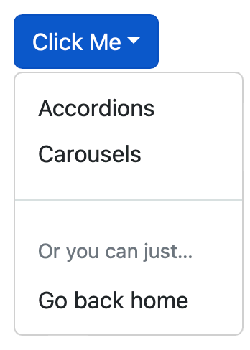
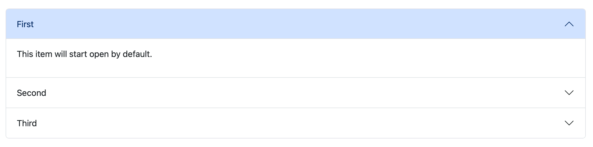
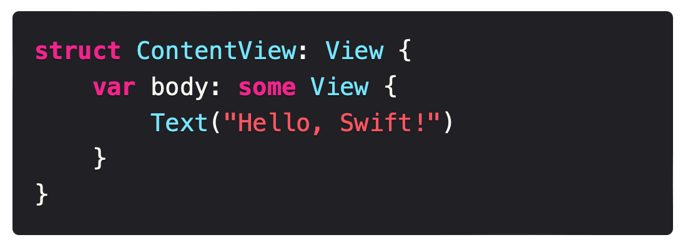

<p align="center">
    
</p>

<p align="center">
    
    
    <a href="https://twitter.com/twostraws">
        
    </a>
</p>

Ignite is a static site builder for Swift developers, offering an expressive, powerful API to build beautiful websites that work great on all devices.

Ignite doesn't try to convert SwiftUI code to HTML, or simply map HTML tags to Swift code. Instead, it aims to use SwiftUI-like syntax to help you build great websites even if you have no knowledge of HTML or CSS.


## Getting started

The easiest way to get started is to use the Ignite command-line tool included with this package:

1. Run `git clone https://github.com/twostraws/Ignite` to clone this repository to your computer.
2. Change into the new directory, e.g. `cd Ignite`.
3. Now run `make` to build the Ignite command-line tool.
4. Then run `make install` to install the Ignite command-line tool to `/usr/local/bin`.
5. If that command fails because of permissions issues, you should run `sudo make install` instead.

> [!Note]
> To change install directory: `make install PREFIX_DIR=/my/install/dir`

Once that command-line tool is installed, you can run the following command to create a new site called ExampleSite:

```shell
ignite new ExampleSite
```

Once installed, the command-line tool is helpful for running a local web server for testing and for building your project.

> [!Tip]
> Using the Ignite tool to run a local web server is the best way to preview your site.

Alternatively, you can bring Ignite into an existing project using Swift Package Manager by adding a package dependency for <https://github.com/twostraws/Ignite>.

Once that completes, import Ignite into your Swift code wherever needed:

```swift
import Ignite
```

## Important: Previewing your site

Once you've built your site and are ready to see how it looks, do *not* just double-click one of the files in Finder. This will open the file directly in your browser, which means it won't know how to locate the rest of your site – the stylesheets, JavaScript code, etc – so it will not display correctly.

Instead, the best way to preview your site is using the Ignite CLI tool, which you installed in Getting Started above:

- Run `ignite run --preview` to preview your site and open it in your web browser.
- If Ignite tells you there is already a web server running on that port, run `ignite run --preview --force`.

That will open your web browser straight to your site. You can then return to Xcode and make changes to your site freely – every time you press Cmd+R to build your site, you can refresh your browser to see the changes.


## See it in action

The [IgniteSamples](https://github.com/twostraws/IgniteSamples) repository contains lots of sample code for you to try out – you can see it running here: You can see all the output from this repository running here: <https://ignitesamples.hackingwithswift.com>.

Basic Ignite code looks similar to SwiftUI code:

```swift
Text("Swift rocks")
    .font(.title1)
    
Text(markdown: "Add *inline* Markdown")
    .foregroundStyle(.secondary)

Link("Swift", target: "https://www.swift.org")
    .linkStyle(.button)

Divider()

Image("logo.jpg")
    .accessibilityLabel("The Swift logo.")
    .padding()
```

But it also includes a range of more advanced controls such as dropdown buttons:

```swift
Dropdown("Click Me") {
    Link("Accordions", target: AccordionExamples())
    Link("Carousels", target: CarouselExamples())
    Divider()
    Text("Or you can just…")
    Link("Go back home", target: "/")
}
.role(.primary)
```



It includes accordions that show or hide items based on what is selected:

```swift
Accordion {
    Item("First", startsOpen: true) {
        Text("This item will start open by default.")
    }

    Item("Second") {
        Text("This is the second accordion item.")
    }

    Item("Third") {
        Text("This is the third accordion item.")
    }
}
.openMode(.individual)
```


 
It has automatic code syntax highlighting for a dozen languages:

```swift
CodeBlock(language: "swift", """
struct ContentView: View {
    var body: some View {
        Text("Hello, Swift!")
    }
}
""")
```



Plus carousels, badges, alerts, tables, and so much more.

There is a separate repository called [IgniteSamples](https://github.com/twostraws/IgniteSamples), which provides sample code for a wide variety of protocols, elements, and modifiers used by Ignite.

If you're looking for code to help you get started, that's the best place – you can build that site and run it locally, the copy and paste any code you want to try.


## Folder structure

Ignite sites are just Swift package, but they use a specific folder structure to help build your site effectively.

- **Assets**: This is where your custom site assets should be placed, using whatever subfolders you want.
- **Build**: This is created automatically by Ignite whenever you build your site. Do not place important information here, because it will be deleted on your next build.
- **Content:** This is where you want to place any Markdown files for posts you want, again using any subfolder structure you want. (Optional)
- **Includes:** This is where you place any custom HTML you've written that you want to include. (Optional)
- **Sources:** This is where you'll place all your Swift code for your site, using any subfolder structure that suits you.

This folder structure is already in place in the [Ignite Starter Template](https://github.com/twostraws/IgniteStarter) repository, and I recommend you start with that.

## Create a layout to render Markdown files

Adding Markdown files to **Content** will render these to HTML pages and include them in **Build** with their respective folder structure, minus the **Content** part.

For example, adding a new file called `apps.md` to **Content** means having this folder structure:

```bash
├── Content
│   └── apps.md
```

And it results inn this **Build** structure:

```bash
├── Build
│   ├── …
│   ├── apps
│   │   └── index.html
│   ├── …
```

**A precondition for this to work is to have a layout available to render your content.** If you don't have a valid layout in place, Ignite will issue a warning saying "Your site must provide at least one layout in order to render Markdown."

You can create custom layouts by making types conform to the `ContentPage` protocol. For example:

```swift
import Foundation
import Ignite

struct Layout: ContentPage {
    func body(content: Content, context: PublishingContext) -> [any BlockElement] {
        Text(content.title)
            .font(.title1)

        if let image = content.image {
            Image(image, description: content.imageDescription)
                .resizable()
                .cornerRadius(20)
                .frame(maxHeight: 300)
                .horizontalAlignment(.center)
        }

        if content.hasTags {
            Group {
                Text("Tagged with: \(content.tags.joined(separator: ", "))")

                Text("\(content.estimatedWordCount) words; \(content.estimatedReadingMinutes) minutes to read.")
            }
        }

        Text(content.body)
    }
}
```

Once you've defined a custom layout, you should add it to your `Site` struct. This can be done by adding this new layout to the `layouts` property of the site, like this:

```swift
struct ExampleSite: Site {    
    var name = "Hello World"
    var url: URL = URL("https://www.example.com")

    var homePage = Home()
    var theme = MyTheme()

    /* This part adds the custom layout */
    var layouts: [any ContentPage] {
        Layout()
    }
}
```


## Using the command-line tool

Once you have installed the Ignite command-line tool from this repository, you can use it in various ways.

First, you can create new site like this:

```shell
ignite new YourSite
```

When that completes, it will tell you the commands to use to open your new site for editing in Xcode:

```shell
cd YourSite
open Package.swift
```

> [!Tip]
> If you want to build with Xcode, go to the Product menu and choose Destination > My Mac.

Back in your terminal window, once you have run that `cd` command the current working directory of your terminal is your website's directory. This means you can run the following command to build your site, rather than using Xcode:

```shell
ignite build
```

That will convert all your Swift code to HTML in your **Build** folder. 

You can also run this command:

```shell
ignite run --preview
```

That will launch a local web server you should use to preview your site, and also open it in your browser. If you're working in Xcode, you can continue performing builds as normal then refresh your browser to see your changes.

> [!Tip]
> The Ignite command-line tool has various configuration options available. Run `ignite help` to get general help, or add `help` before a subcommand to get further details, e.g. `ignite help run`.


## Websites made with Ignite

| Website                | Repository                                |
|------------------------|-------------------------------------------|
| [jcalderita Portfolio](https://jcalderita.com) | [GitHub](https://github.com/jcalderita/portfolio-web-ignite) |
| [Fotogroep de Gender](http://www.vdhamer.com/fgDeGender) | [GitHub](https://github.com/vdhamer/Photo-Club-Hub-HTML) |
| [sookim-1's T.W.L](https://sookim-1.github.io) | [GitHub](https://github.com/sookim-1/blog-website) |


## Contributing

I welcome all contributions, whether that's adding new tests, fixing up existing code, adding comments, or improving this README – everyone is welcome!

- You must comment your code thoroughly, using documentation comments or regular comments as applicable.
- All code must be licensed under the MIT license so it can benefit the most people.
- If you create a new element, please consider adding it to the IgniteSamples repository, so folks can see it more easily.


## License

MIT License.

Copyright (c) 2024 Paul Hudson.

Permission is hereby granted, free of charge, to any person obtaining a copy of this software and associated documentation files (the "Software"), to deal in the Software without restriction, including without limitation the rights to use, copy, modify, merge, publish, distribute, sublicense, and/or sell copies of the Software, and to permit persons to whom the Software is furnished to do so, subject to the following conditions:

The above copyright notice and this permission notice shall be included in all copies or substantial portions of the Software.

THE SOFTWARE IS PROVIDED "AS IS", WITHOUT WARRANTY OF ANY KIND, EXPRESS OR IMPLIED, INCLUDING BUT NOT LIMITED TO THE WARRANTIES OF MERCHANTABILITY, FITNESS FOR A PARTICULAR PURPOSE AND NONINFRINGEMENT. IN NO EVENT SHALL THE AUTHORS OR COPYRIGHT HOLDERS BE LIABLE FOR ANY CLAIM, DAMAGES OR OTHER LIABILITY, WHETHER IN AN ACTION OF CONTRACT, TORT OR OTHERWISE, ARISING FROM, OUT OF OR IN CONNECTION WITH THE SOFTWARE OR THE USE OR OTHER DEALINGS IN THE SOFTWARE.

Ignite was originally created by [Paul Hudson](https://twitter.com/twostraws), who writes [free Swift tutorials over at Hacking with Swift](https://www.hackingwithswift.com). It’s available under the MIT license, which permits commercial use, modification, distribution, and private use.

Other contributors to Ignite include Henrik Christensen, Michael Freiwald, and Jobert Sá – thank you!


<p align="center">
    <a href="https://www.hackingwithswift.com/plus">
    </a>
</p>

<p align="center">&nbsp;</p>

<p align="center">
    <a href="https://www.hackingwithswift.com"></a><br />
    A Hacking with Swift Project
</p>
